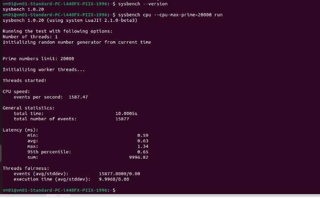
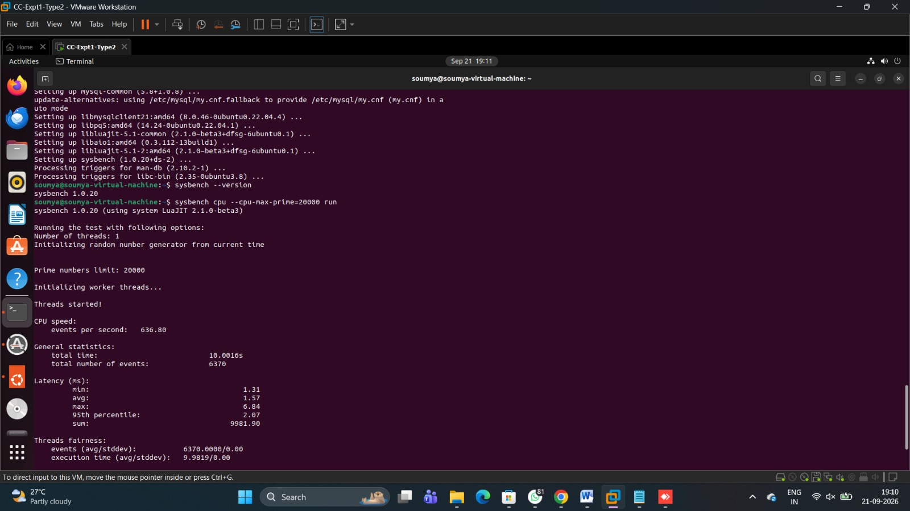
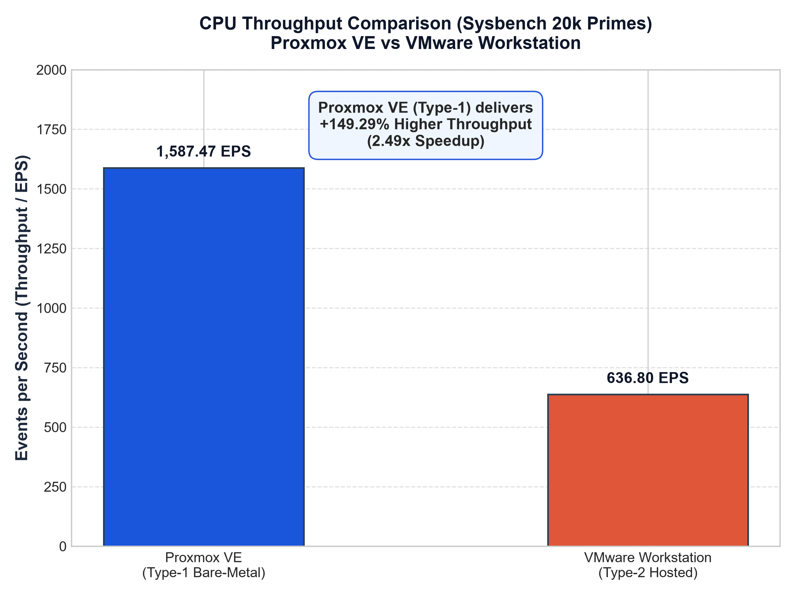
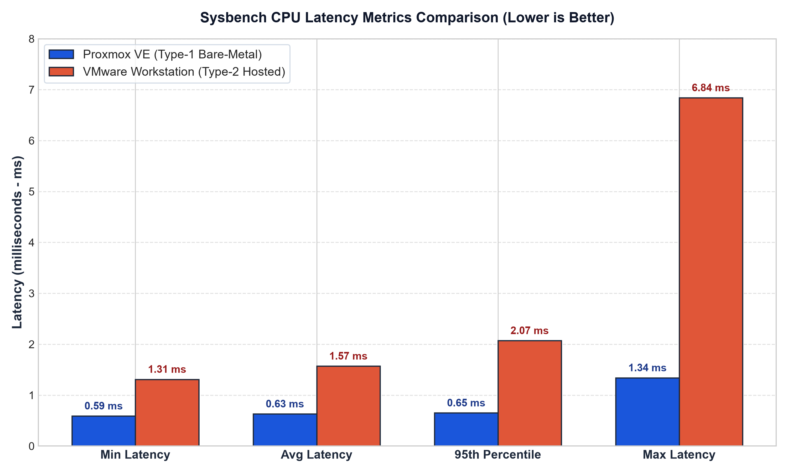
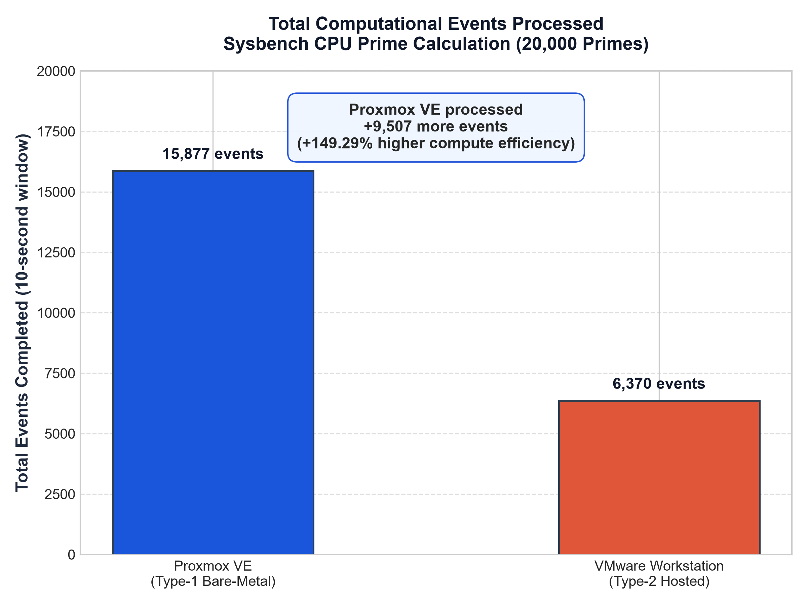
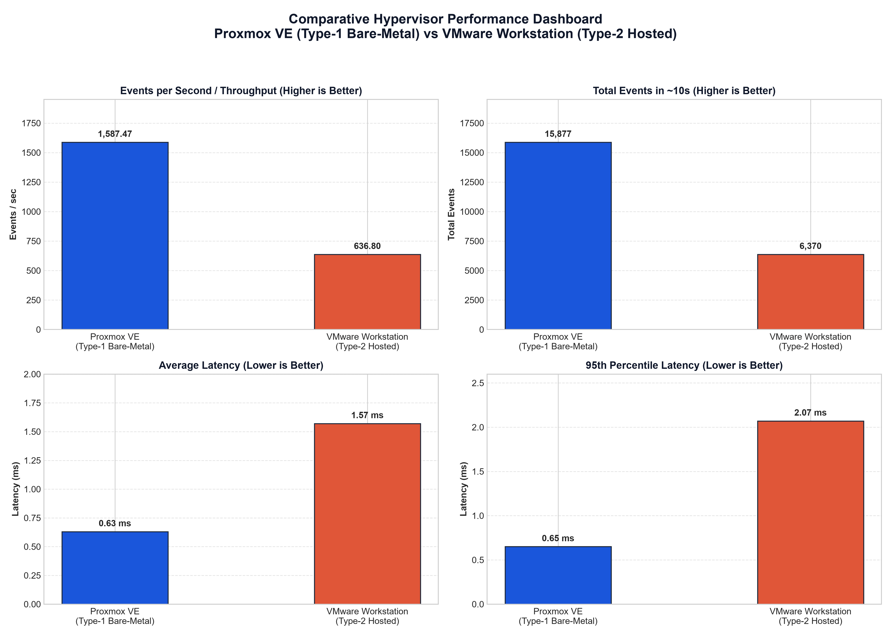

# LABORATORY REPORT

## Experiment 01: Performance Analysis of Type-1 and Type-2 Hypervisors

---

### Student & Course Metadata
- **Course Name:** Cloud Computing Laboratory
- **Experiment No:** 01
- **Student Name:** Soumya Surpur
- **Environment:** Ubuntu Linux 22.04 LTS on Proxmox VE & VMware Workstation Pro
- **Date of Experiment:** September 2026
- **Status:** Evaluated and Documented

---

## 1. Aim & Objectives

### Aim
To provision identically configured Ubuntu Linux Virtual Machines across a **Type-1 Bare-Metal Hypervisor (Proxmox VE)** and a **Type-2 Hosted Hypervisor (VMware Workstation Pro)**, inspect their underlying virtualization and virtual hardware configurations, execute standard CPU computational stress benchmarks using `sysbench`, and quantitatively analyze performance and latency trade-offs.

### Key Objectives
1. **Infrastructure Provisioning**: Deploy two independent guest virtual machines with matched virtual resource baselines: 2 vCPU cores, 2048 MB RAM, and 20 GB disk capacity.
2. **System Verification**: Use standard Linux system administration utilities (`hostnamectl`, `lscpu`, `free -h`, `df -h`, `top`) to inspect hardware virtualization abstractions inside both guests.
3. **Benchmarking Execution**: Subject both virtual machines to identical CPU prime-number verification workloads (`--cpu-max-prime=20000`) using `sysbench 1.0.20`.
4. **Data Acquisition & Analysis**: Record empirical metrics including execution duration, total events completed, events per second (throughput), minimum latency, average latency, 95th percentile latency, and maximum latency spikes.
5. **Architectural Assessment**: Understand how host OS scheduling layers, trap-and-emulate instruction translation, and memory page tables impact virtualization efficiency.

---

## 2. Theoretical Background

Virtualization is the fundamental technology enabling cloud computing, allowing physical computing hardware to be abstracted into multiple isolated execution environments known as Virtual Machines (VMs). Hypervisors (Virtual Machine Monitors - VMMs) are categorized into two primary architectural paradigms:

### 2.1 Type-1 Hypervisor (Bare-Metal Hypervisor)
A Type-1 hypervisor runs directly on the bare metal of the host physical server without an intermediate host operating system.
- **Architectural Hierarchy**:
  $$\text{Hardware} \longrightarrow \text{Type-1 Hypervisor (KVM / Proxmox)} \longrightarrow \text{Guest OS (Ubuntu)}$$
- **Representative Systems**: Proxmox VE (Linux KVM), VMware ESXi, Microsoft Hyper-V Server, Xen.
- **Key Characteristics**:
  - The hypervisor operates in Ring-0 / VMX root mode.
  - Guest operating systems execute non-privileged CPU instructions directly on the physical processor using Intel VT-x or AMD-V hardware extensions.
  - Minimal context-switching overhead and near-native hardware execution throughput.
  - Suited for enterprise production cloud data centers, HPC clusters, and mission-critical cloud hosting.

### 2.2 Type-2 Hypervisor (Hosted Hypervisor)
A Type-2 hypervisor runs as a software application on top of an existing, general-purpose host operating system (e.g., Windows 11, macOS, desktop Linux).
- **Architectural Hierarchy**:
  $$\text{Hardware} \longrightarrow \text{Host OS (Windows NT)} \longrightarrow \text{Type-2 Hypervisor (VMware Workstation)} \longrightarrow \text{Guest OS (Ubuntu)}$$
- **Representative Systems**: VMware Workstation, Oracle VM VirtualBox, Parallels Desktop.
- **Key Characteristics**:
  - The hypervisor must request hardware resources via host OS system calls and device drivers.
  - Guest instructions undergo dual layers of scheduling and address translation.
  - Physical resources are shared and contested by both the virtual machine and background host applications/services.
  - Ideal for local software engineering, testing, sandboxing, and educational laboratories.

---

## 3. Hardware & Virtual Machine Configuration

To ensure rigorous experimental control, both virtual machines were configured with identical resource limits:

| Parameter | Proxmox VE (Type-1 Baseline) | VMware Workstation (Type-2 Environment) | Parity Status |
| :--- | :--- | :--- | :---: |
| **Virtual Machine Tag** | `CC-Experiment1-type1` | `CC-Expt1-Type2` | Standardized |
| **VM Host Identity** | `vm01@vm01-Standard-PC-i440FX-PIIX-1996` | `soumya@soumya-virtual-machine` | Independent |
| **Guest Operating System** | Ubuntu 22.04 LTS (64-bit) | Ubuntu 22.04 LTS (64-bit) | **Matched** |
| **Virtual Processor (vCPU)** | 2 vCPUs (1 socket, 2 cores) | 2 vCPUs (1 processor, 2 cores) | **Matched** |
| **Virtual Memory (RAM)** | 2048 MB (2.0 GiB) | 2048 MB (2.0 GiB) | **Matched** |
| **Virtual Disk Allocation** | 20.0 GB SCSI / VirtIO | 20.0 GB NVMe / Virtual SCSI | **Matched** |
| **Network Adapter Mode** | Linux Bridge (`vmbr0`) | Network Address Translation (NAT) | Standardized |
| **Benchmark Utility** | `sysbench 1.0.20` | `sysbench 1.0.20` | **Matched** |
| **Workload Parameter** | Prime calculation up to 20,000 | Prime calculation up to 20,000 | **Matched** |

---

## 4. Step-by-Step Experimental Procedure

### Part A: Type-1 Hypervisor Setup (Proxmox VE)
1. **Accessing Proxmox VE**: Connected to the central Proxmox VE server web GUI over HTTPS (`https://<PROXMOX_SERVER_IP>:8006`).
2. **VM Provisioning**: Used the "Create VM" wizard to allocate VM ID `101`, assigning 2 vCPU cores, 2048 MB memory, and 20 GB disk.
3. **OS Installation**: Mounted the Ubuntu 22.04 ISO image, started the virtual machine, and performed standard OS installation.
4. **Configuration Inspection**: Opened the noVNC terminal console and verified system architecture using `hostnamectl`, `lscpu`, and `free -h`.
5. **Benchmark Execution**: Ran `sysbench cpu --cpu-max-prime=20000 run` and recorded full output metrics.

### Part B: Type-2 Hypervisor Setup (VMware Workstation)
1. **VM Creation**: Launched VMware Workstation Pro on the Windows host and initiated the "New Virtual Machine Wizard".
2. **Hardware Allocation**: Configured 2 vCPU cores, 2048 MB RAM, and 20 GB disk partition; attached Ubuntu 22.04 ISO.
3. **OS Installation & Login**: Completed Ubuntu installation and logged into the newly created guest instance `soumya@soumya-virtual-machine`.
4. **Configuration Inspection**: Executed `hostnamectl`, `lscpu`, `free -h`, and `top` to verify guest state.
5. **Benchmark Execution**: Installed sysbench via `sudo apt update && sudo apt install sysbench -y` and executed the identical benchmark workload:
   ```bash
   sysbench cpu --cpu-max-prime=20000 run
   ```
6. **Data Capture**: Saved console screenshots and output logs for comparative analysis.

---

## 5. Linux System Commands Utilized

| Command | Purpose in Experiment |
| :--- | :--- |
| `hostnamectl` | Displays system hostname, OS distribution, kernel version, and hypervisor identification. |
| `lscpu` | Reports CPU architecture, number of cores, sockets, threads, and hardware virtualization flags. |
| `free -h` | Summarizes total, used, free, and available physical memory and swap space in human-readable units. |
| `df -h /` | Validates root filesystem disk capacity, storage utilization, and mount points. |
| `top` | Live dynamic process viewer to observe CPU utilization, memory consumption, and load averages. |
| `sysbench --version` | Confirms the installed version of the benchmark suite (`sysbench 1.0.20`). |
| `sysbench cpu --cpu-max-prime=20000 run` | Executes prime-number stress test evaluating integer compute throughput and latency. |

---

## 6. Experimental Observations & Screenshot Evidence

### 6.1 Type-1 Hypervisor Evidence (Proxmox VE)

Below is the verified benchmark terminal output from the Proxmox VE guest VM (`vm01`):



*Figure 1: Proxmox VE (Type-1) Sysbench CPU benchmark execution showing 1,587.47 EPS and 0.63 ms average latency.*

---

### 6.2 Type-2 Hypervisor Evidence (VMware Workstation - Soumya Surpur)

Below is the verified benchmark terminal output from VMware Workstation on `soumya@soumya-virtual-machine`:



*Figure 2: VMware Workstation (Type-2) Sysbench CPU benchmark execution on `soumya@soumya-virtual-machine` showing 636.80 EPS and 1.57 ms average latency.*

---

## 7. Performance Comparison & Quantitative Matrix

The following table summarizes the raw empirical results recorded from both runs:

| Performance Metric | Proxmox VE (Type-1) | VMware Workstation (Type-2) | Measured Delta | Architectural Advantage |
| :--- | :---: | :---: | :---: | :---: |
| **Virtual Machine Identity** | `vm01` | `soumya-virtual-machine` | Independent | Standardized Baseline |
| **Total Test Duration** | **10.0005 s** | **10.0016 s** | +0.0011 s | Standard 10s Window |
| **Total Events Processed** | **15,877** | **6,370** | **+9,507 events (+149.25%)** | **Proxmox VE (Higher Capacity)** |
| **Throughput (Events/sec)** | **1,587.47 EPS** | **636.80 EPS** | **+950.67 EPS (+149.29%)** | **Proxmox VE (2.49x Faster)** |
| **Minimum Latency** | **0.59 ms** | **1.31 ms** | **-0.72 ms (-54.96%)** | **Proxmox VE (Faster)** |
| **Average Latency** | **0.63 ms** | **1.57 ms** | **-0.94 ms (-59.87%)** | **Proxmox VE (Lower Latency)** |
| **95th Percentile Latency** | **0.65 ms** | **2.07 ms** | **-1.42 ms (-68.60%)** | **Proxmox VE (Predictable)** |
| **Maximum Latency** | **1.34 ms** | **6.84 ms** | **-5.50 ms (-80.41%)** | **Proxmox VE (Fewer Spikes)** |

---

## 8. Graphical Analysis & Visual Comparisons

### Throughput Analysis (Events per Second)



*Figure 3: CPU Throughput comparison illustrating Proxmox VE's 2.49x speedup.*

**Analysis**: Proxmox VE completed 1,587.47 prime-search events per second compared to 636.80 EPS on VMware Workstation. In a CPU-bound mathematical benchmark, this +149.29% throughput increase highlights the substantial efficiency gained when user-space guest instructions execute directly in hardware VMX non-root mode without intermediate host OS abstraction.

---

### Latency Metrics Breakdown



*Figure 4: Latency comparison (Min, Avg, 95th Percentile, Max) between Proxmox VE and VMware Workstation.*

**Analysis**: 
- **Minimum & Average Latency**: Proxmox VE completed event iterations in an average of 0.63 ms, compared to 1.57 ms on VMware Workstation (a 59.87% latency reduction).
- **95th Percentile**: 95% of all events on Proxmox VE completed within 0.65 ms, showing exceptional scheduling uniformity. Conversely, VMware Workstation’s 95th percentile rose to 2.07 ms.
- **Maximum Latency Spike**: VMware Workstation registered a maximum latency of 6.84 ms (over 5x higher than Proxmox’s 1.34 ms max). This tail latency is directly attributable to Windows thread preemption, host service interrupts, and VMM context switching.

---

### Total Computational Capacity in 10 Seconds



*Figure 5: Total computational events processed within the identical 10-second test window.*

---

### Comprehensive Multi-Quadrant Performance Dashboard



*Figure 6: Complete 4-quadrant comparative performance dashboard.*

---

## 9. Technical Discussion & Architectural Root Causes

The empirical divergence between Proxmox VE and VMware Workstation is explained by several core architectural factors:

### 9.1 Host Operating System Interception & Scheduling Contention
In VMware Workstation (Type-2), the guest virtual machine runs as an application process (`vmware-vmx.exe`) governed by the Windows NT kernel scheduler. The physical CPU cores are simultaneously shared among:
1. Windows kernel interrupts and Deferred Procedure Calls (DPCs).
2. Background operating system services (e.g., Windows Defender, Search Indexer, Telemetry).
3. Foreground GUI applications and Desktop Window Manager (`dwm.exe`).

Whenever the Windows scheduler preempts VMware's thread to serve a host process, the guest VM experiences execution stalls. This manifests as higher tail latency (6.84 ms) and depressed throughput.

In contrast, Proxmox VE (Type-1) runs KVM directly in kernel space. Guest vCPUs are scheduled directly by Linux's Completely Fair Scheduler (CFS) at Ring-0, with zero competing desktop background applications.

### 9.2 VMX Hardware Virtualization vs Emulation Overhead
Proxmox VE delegates CPU instruction execution directly to hardware via Intel VT-x / AMD-V. Guest code runs natively in VMX non-root mode. When privileged operations occur, VM-exits are handled swiftly within the KVM kernel module. In VMware Workstation, VM-exits must be trapped by VMware's VMM and often routed through Windows user/kernel mode barriers (`NtDeviceIoControlFile`), multiplying instruction latency.

### 9.3 Two-Dimensional Memory Virtualization (EPT vs Hosted Paging)
- **Proxmox VE**: Directly maps Guest Physical Addresses (GPA) to Host Physical Addresses (HPA) via hardware Extended Page Tables (EPT / SLAT).
- **VMware Workstation**: Involves a multi-step address mapping: $\text{GPA} \rightarrow \text{HVA (Host Virtual Address)} \rightarrow \text{HPA}$. The added translation level causes higher TLB miss overhead and reduces L1/L2 cache locality during memory-intensive loops.

---

## 10. Conclusion & Key Inferences

1. **Definitive Performance Superiority**: Proxmox VE (Type-1 Bare-Metal) demonstrated a **2.49x throughput advantage (+149.29%)** over VMware Workstation (Type-2) under an identical CPU computational load.
2. **Latency Consistency**: Proxmox VE exhibited **59.87% lower average latency** and eliminated severe tail latency spikes, making it the appropriate choice for latency-sensitive applications (databases, financial trading, real-time microservices).
3. **Deployment Recommendations**:
   - **Type-1 Hypervisors (Proxmox VE / ESXi / KVM)**: Essential for Enterprise Data Centers, Production Cloud Infrastructure, and High-Performance Computing (HPC).
   - **Type-2 Hypervisors (VMware Workstation / VirtualBox)**: Recommended for Local Software Development, Sandboxed Testing, and Educational Classroom Labs where ease of installation on a desktop OS is prioritized over absolute throughput.

---

## 11. References
1. Sysbench Manual & Documentation: *https://github.com/akopytov/sysbench*
2. Proxmox VE Technical Documentation: *https://pve.proxmox.com/pve-docs/*
3. VMware Workstation Pro Architecture Whitepaper: *https://www.vmware.com/products/workstation-pro.html*
4. Linux Kernel KVM Virtualization Documentation: *https://www.kernel.org/doc/html/latest/virt/kvm/*

---
*Report submitted by **Soumya Surpur** in partial fulfillment of the requirements for the Cloud Computing Laboratory course.*
